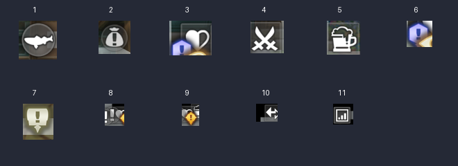

# 基础移动与传送

当前提供三个独立入口，识别与点击定义在 `assets/resource/pipeline/navigation.json`，
位置校验和路点推进在 `agent/navigation.py`。

| 入口 | 行为与成功条件 |
| --- | --- |
| `NavigationMove`（基础移动） | 按选定方向滑动 600ms；展开区域地图，确认仍在原地图且角色沿预期方向产生位移，再恢复主界面。 |
| `NavigationTeleport`（传送至巴尔沃基） | 打开世界地图 → 现代 → 巴尔沃基 → 核对目的地弹窗 → 确认；落地后展开区域地图，OCR 核对“巴尔沃基”，关闭区域地图才完成。 |
| `NavigationBaruokiRoute`（巴尔沃基寻路示例） | 从传送落点向左到路口，再向上到北侧道路；逐个核对路点 `(600,339)`、`(600,254)`，最后恢复主界面。 |

## 运行条件

- 另一个伊甸国服，ADB 控制器，短边缩放为 720，实际截图为 1280×720。
- 从菜单与地图按钮可见的主界面开始；先关闭世界地图、区域地图和其他弹窗。
- Python 依赖见 `agent/requirements.txt`。新移动任务需要 Python Custom Action。
- OCR 模型放在 `assets/resource/model/ocr/`，需要 `det.onnx`、`rec.onnx`、`keys.txt`。
  获取方法见 [如何开发](how_to_develop.md)。模型遵循既有忽略规则，不提交至 Git。
- 寻路示例须先传送到巴尔沃基。其他道路上的相似坐标不能作为起点；起点范围检查不通过即停止。

已配置 Agent 启动与动作注册。发布布局中 `interface.json` 和 `agent/` 同级，
`child_exec: python` 要求客户端能找到装有上述依赖的 Python。
仓库开发布局的 `assets/interface.json` 与 `agent/` 不同级，直接开发建议使用下述命令行入口。
本机 AgentClient 的独立进程通信初始化遇到 ZeroMQ `Bad file descriptor`，IPC/TCP 均未通过，
因此目前实机验证使用同进程注册；不宣称通用 GUI 客户端已验证成功。

```powershell
# 用实际 Python、ADB 路径和端口替换示例。
python -X utf8 tools/run_startup.py --adb-path 'E:\Program Files\Netease\MuMu\nx_main\adb.exe' --address 127.0.0.1:16384 --task NavigationTeleport
python -X utf8 tools/run_startup.py --adb-path 'E:\Program Files\Netease\MuMu\nx_main\adb.exe' --address 127.0.0.1:16384 --task NavigationBaruokiRoute
python -X utf8 tools/run_startup.py --adb-path 'E:\Program Files\Netease\MuMu\nx_main\adb.exe' --address 127.0.0.1:16384 --task NavigationMove --direction right
python -X utf8 tools/test_navigation.py
```

退出码 0 表示达到完成节点，1 表示失败，130 表示 Ctrl+C 停止。
日志位于被忽略的 `debug/navigation-run/`，含地图名、移动方向、时长与前后位置。

## 定位与保护

右上小地图会跟随视野平移，不能直接用其屏幕坐标作世界坐标。
点击小地图可展开固定布局的区域地图，同时在左上显示地图名。
每一步均打开区域地图识别角色标记，关闭地图后再滑动，随后重新定位。
角色标记存在缩放动画，因此收集了多种尺寸；等待可识别帧的上限为 4 秒，
同一位置的多尺寸命中会归为一个标记，不同位置出现候选时停止。小幅中心抖动不算行走成功。

上下移动可能直接沿连接道路切换至另一条横向道路，不按固定速度推算纵向位置。
转弯前路点采用 2px 对齐容差，最终到达采用 5px 容差，避免在终点因标记动画反复微调。
当前寻路使用已实测的路点，不包含未知地图的自动道路提取、A*、跨图连续寻路或任意图例导航。
扩展地图时应重新采集展开图布局、地图名、路点和连接关系，并验证实际转向。

单次滑动参数限制为 150～1200ms；路线采用最多 600ms 的小步，每个路点最多 20 步，
整个 Custom Action 最多 180 秒。截图、动作和循环均检查用户停止状态。
同图位移未确认、地图改变、标记丢失、未知弹窗或超时均失败，不把“成功发送滑动”当成到达。
停止时不再发送关闭地图的点击，可能保留展开图，用户可手动关闭。

途中只在攻击按钮与战斗状态同时识别成功时攻击；每次等待主界面最多 90 秒、30 次攻击。
已知道具/经验结算页点击空白处继续。没有自动复活、技能选择、购买或陌生弹窗处理。

## 已确认图例

下面的含义由用户于 2026-09-05 确认。截图来自巴尔沃基和起始传送门场景；
本次仅建立图例目录，还未把它们注册为自动导航目标。



| 编号 | 含义 |
| --- | --- |
| 1 | 钓鱼点 |
| 2 | 商人 |
| 3 | 旅店 |
| 4 | 武器店 |
| 5 | 酒馆 |
| 6 | 角色任务点 |
| 7 | 展品任务点 |
| 8 | 事件 |
| 9 | 普通任务点 |
| 10 | 地图出入口 |
| 11 | 楼梯 |

## 验证记录与边界

副本前置的次元夹缝传送与蓝门交互见 [副本入口与指定次数跳过](dungeons.md)。

2026-09-05，MaaFramework 5.12.3，MuMu ADB，2560×1440 缩放至 1280×720。

- 实机：巴尔沃基传送及落地名称核验；左、右、下移动；完整路线向左并向上转弯到 `(599,254)`；北侧道路向上撞墙时拒绝成功并恢复主界面。
- 参数、反向/无位移拒绝、路点容差与越界纠正、错误起点、步数上限、停止与时间上限：`tools/test_navigation.py`。
- 实际截图回放：区域地图多种标记尺寸、世界地图与确认框互斥、缺少目的地文本的合成弹窗拒绝；停止期间不会继续滑动或发送关闭地图点击。
- Pipeline/Interface Schema、maa-tools 检查。

普通野外战斗和结算、跨地图出口、其他地图/分辨率、通用 GUI 客户端尚未实机验证。
战斗识别沿用已验证试炼素材，普通战斗 UI 若不同，需要补充样本。

流程字段已核对本地 Schema 与 [MaaFramework Pipeline 协议](https://maafw.com/docs/3.1-PipelineProtocol/)。
