# 2026-09-19 小地图导航扩图实测

共 15 张实际进入、截图标定并发起导航的新区域，最终 7 张到达，8 张未到达。

新区域指此前项目中未找到实机导航记录；不是账号探索进度。每张地图使用现场展开图标定目标。失败项未伪装成到达。

开图次数只统计导航开始至结束，包含初始校准和终点核验，不含前期标定、传送和人工进入地图。坐标及误差均为 1280×720 展开图像素。

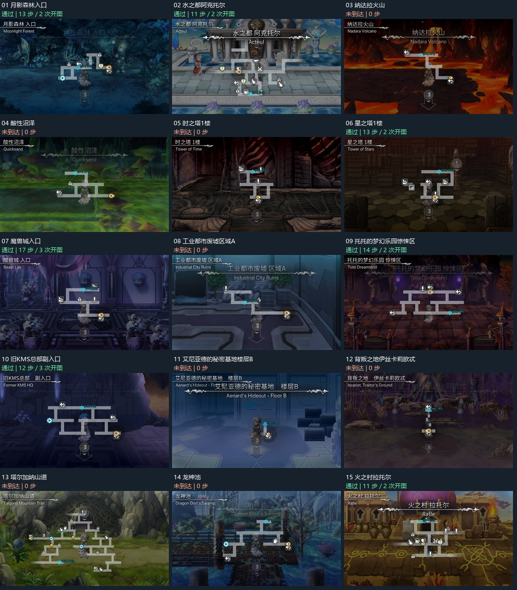

| 地图 | 目标 | 结果 | 移动 | 开图 | 到目标误差 |
| --- | --- | --- | ---: | ---: | ---: |
| 月影森林入口 | [590, 369] | 通过 | 13 | 2 | 2.26px |
| 水之都阿克托尔 | [590, 570] | 通过 | 11 | 2 | 3.71px |
| 纳达拉火山 | [580, 274] | 未到达 | 0 | 1 | — |
| 酸性沼泽 | [570, 274] | 未到达 | 0 | 1 | — |
| 时之塔1楼 | [610, 263] | 未到达 | 0 | 1 | — |
| 星之塔1楼 | [720, 263] | 通过 | 13 | 2 | 2.43px |
| 魔兽城入口 | [630, 263] | 通过 | 17 | 3 | 1.86px |
| 工业都市废墟区域A | [550, 360] | 未到达 | 0 | 1 | — |
| 托托的梦幻乐园惊悚区 | [800, 440] | 通过 | 14 | 2 | 3.84px |
| 旧KMS总部副入口 | [620, 263] | 通过 | 12 | 3 | 6.25px |
| 艾尼亚德的秘密基地楼层B | [705, 390] | 未到达 | 0 | 1 | — |
| 背叛之地伊丝卡莉欧忒 | [640, 282] | 未到达 | 0 | 1 | — |
| 塔尔加纳山道 | [450, 542] | 未到达 | 0 | 1 | — |
| 龙神池 | [710, 232] | 未到达 | 0 | 1 | — |
| 火之村拉托尔 | [580, 232] | 通过 | 11 | 2 | 1.59px |

## 逐图证据

### 月影森林入口

中央横路，左侧向下路口右侧

道路：人工按截图标定中心线。

最终记录：[result.json](D:/MAAEden/debug/minimap/survey/cat_18/run1/result.json)；尝试次数：1。

结果：独立展开图确认到达。

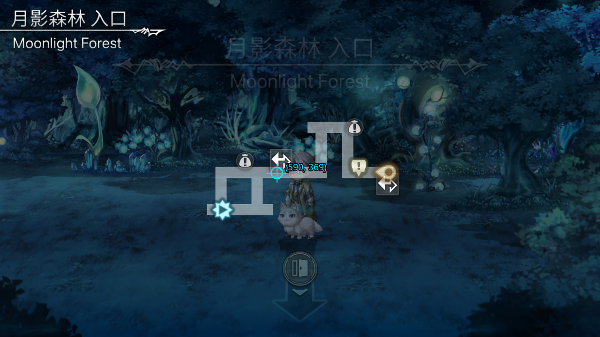

### 水之都阿克托尔

最下方横路，酒馆南侧

道路：人工按截图标定中心线。

最终记录：[result.json](D:/MAAEden/debug/minimap/survey/cat_06/run3/result.json)；尝试次数：3。

结果：独立展开图确认到达。

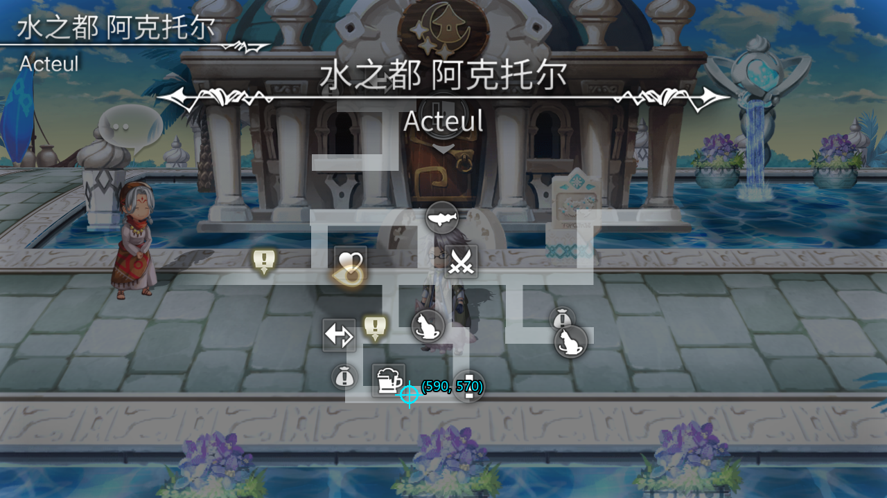

### 纳达拉火山

上方横路，出口右侧

道路：运行时自动提取。

最终记录：[result.json](D:/MAAEden/debug/minimap/survey/cat_04/run2/result.json)；尝试次数：2。

结果：小地图定位候选 0：小地图匹配不足：4

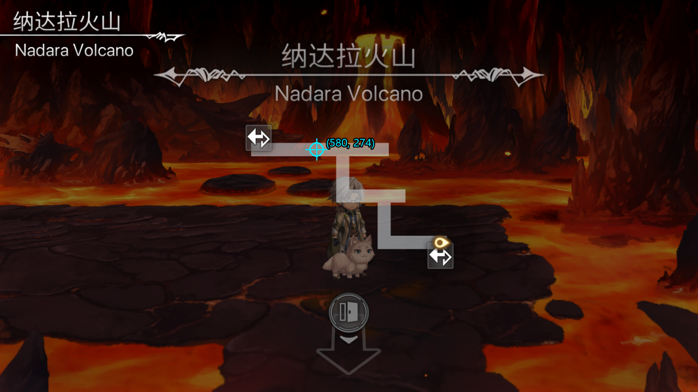

### 酸性沼泽

上方横路中央

道路：运行时自动提取。

最终记录：[result.json](D:/MAAEden/debug/minimap/survey/cat_08/run1/result.json)；尝试次数：1。

结果：地图不符：预期 酸性沼泽，实际 酸性洛泽；保留现场

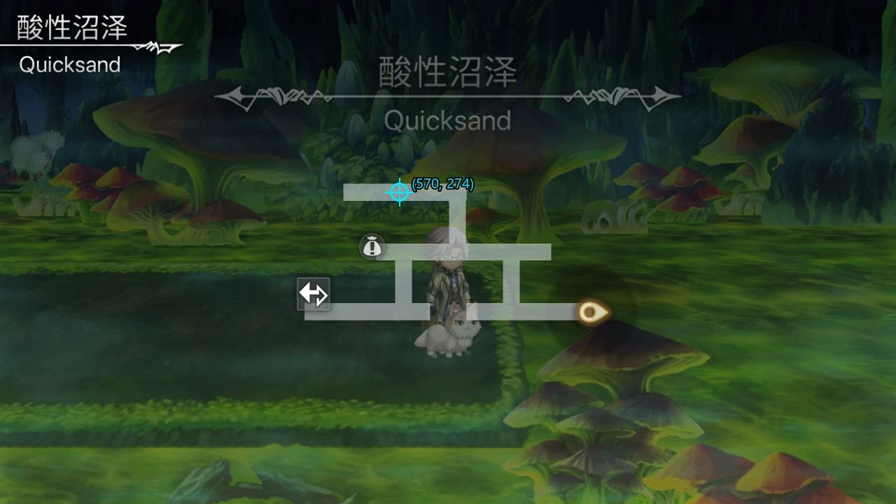

### 时之塔1楼

上层横路，楼梯与叹号之间

道路：运行时自动提取。

最终记录：[result.json](D:/MAAEden/debug/minimap/survey/cat_10/run1/result.json)；尝试次数：1。

结果：小地图定位候选 0：小地图几何约束不符：inliers=5/10 scale=1.000 angle=0.28

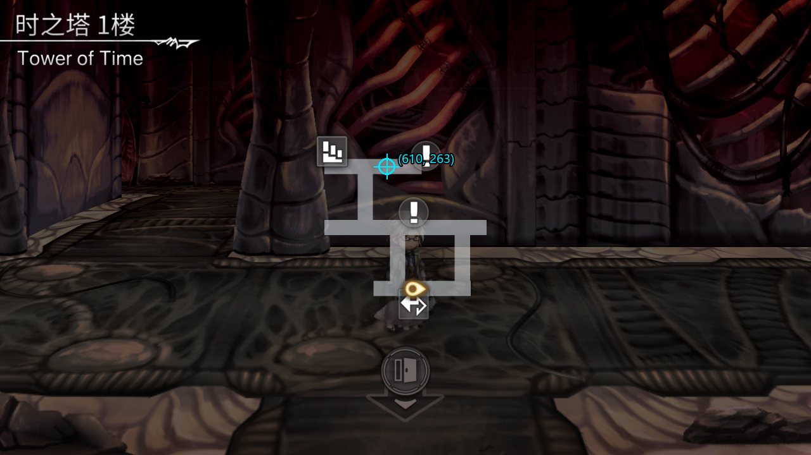

### 星之塔1楼

最上方横路中央

道路：运行时自动提取。

最终记录：[result.json](D:/MAAEden/debug/minimap/survey/cat_12/run2/result.json)；尝试次数：2。

结果：独立展开图确认到达。

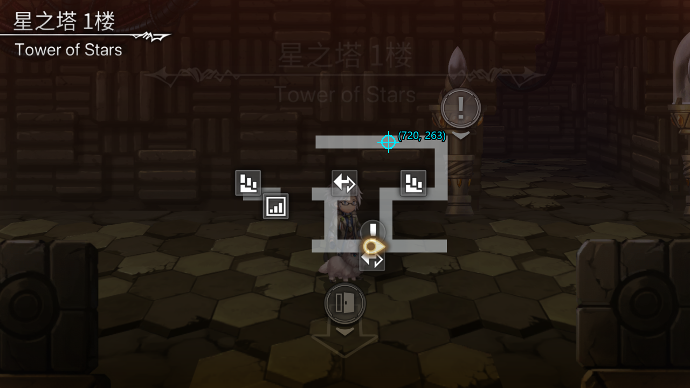

### 魔兽城入口

上层横路中央，楼梯左侧

道路：运行时自动提取。

最终记录：[result.json](D:/MAAEden/debug/minimap/survey/cat_23/run1/result.json)；尝试次数：1。

结果：独立展开图确认到达。

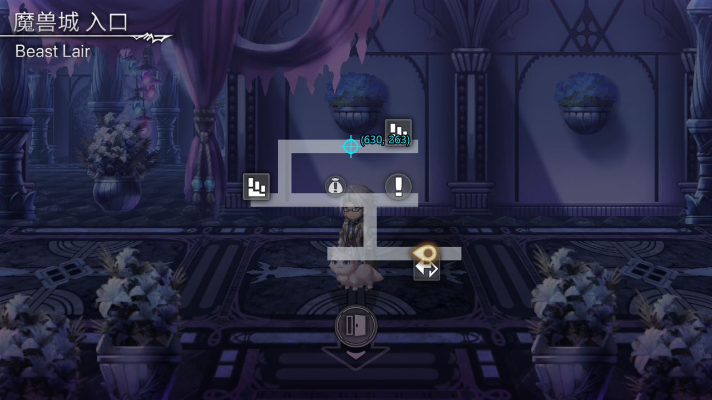

传送落在无小地图的城门外。向上接近门后点击门图标进入；复现导航请在魔兽城入口使用 run，不直接 --teleport。

### 工业都市废墟区域A

中层横路，连接路左侧

道路：运行时自动提取。

最终记录：[result.json](D:/MAAEden/debug/minimap/survey/cat_38/run1/result.json)；尝试次数：1。

结果：小地图定位候选 0：小地图几何约束不符：inliers=7/9 scale=0.995 angle=1.51

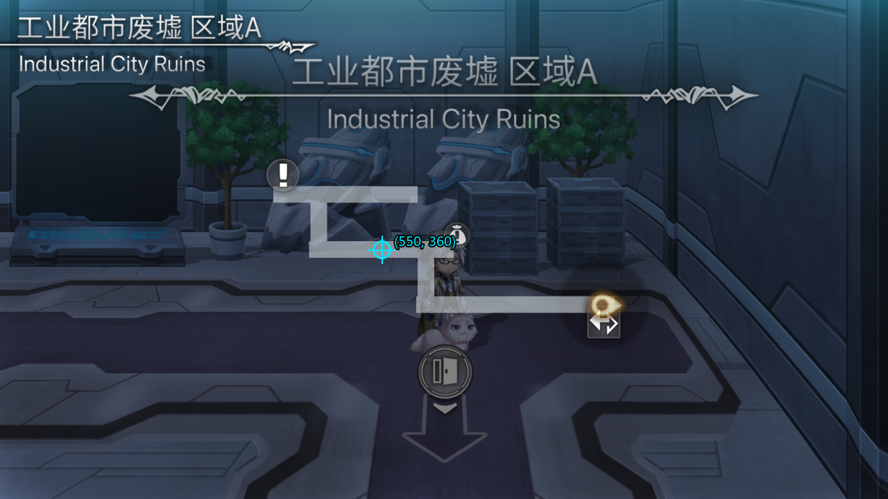

### 托托的梦幻乐园惊悚区

下层横路右半段

道路：运行时自动提取。

最终记录：[result.json](D:/MAAEden/debug/minimap/survey/cat_40/run1/result.json)；尝试次数：1。

结果：独立展开图确认到达。

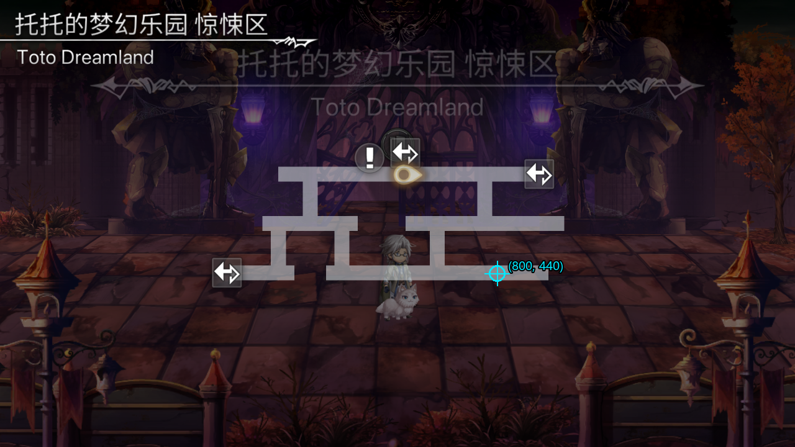

### 旧KMS总部副入口

上层横路中央

道路：人工按截图标定中心线。

最终记录：[result.json](D:/MAAEden/debug/minimap/survey/kms/run2/result.json)；尝试次数：2。

结果：独立展开图确认到达。

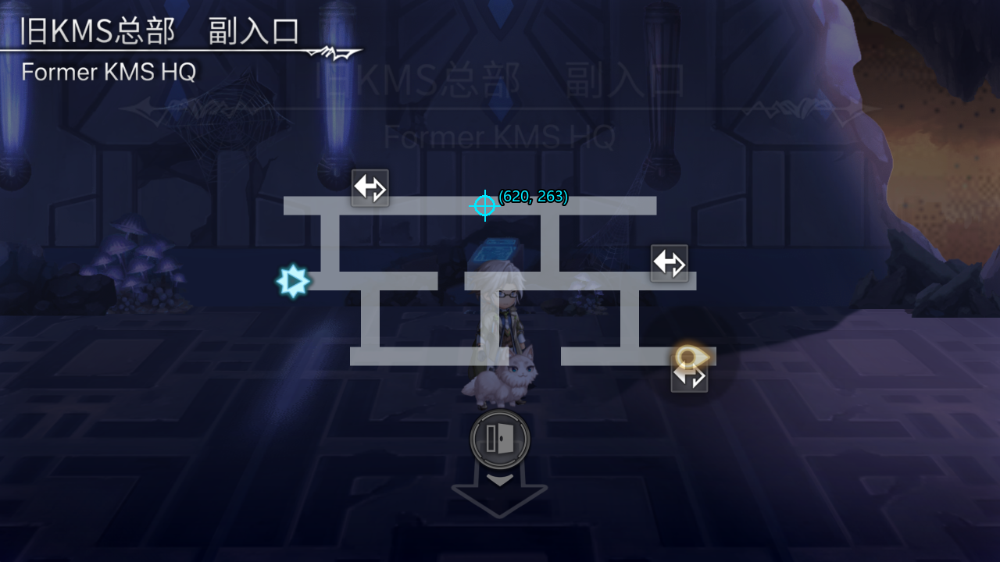

### 艾尼亚德的秘密基地楼层B

已显示短走廊上端内侧

道路：人工按截图标定中心线。

最终记录：[result.json](D:/MAAEden/debug/minimap/survey/fantasy/run1/result.json)；尝试次数：1。

结果：小地图定位候选 0：小地图匹配不足：0

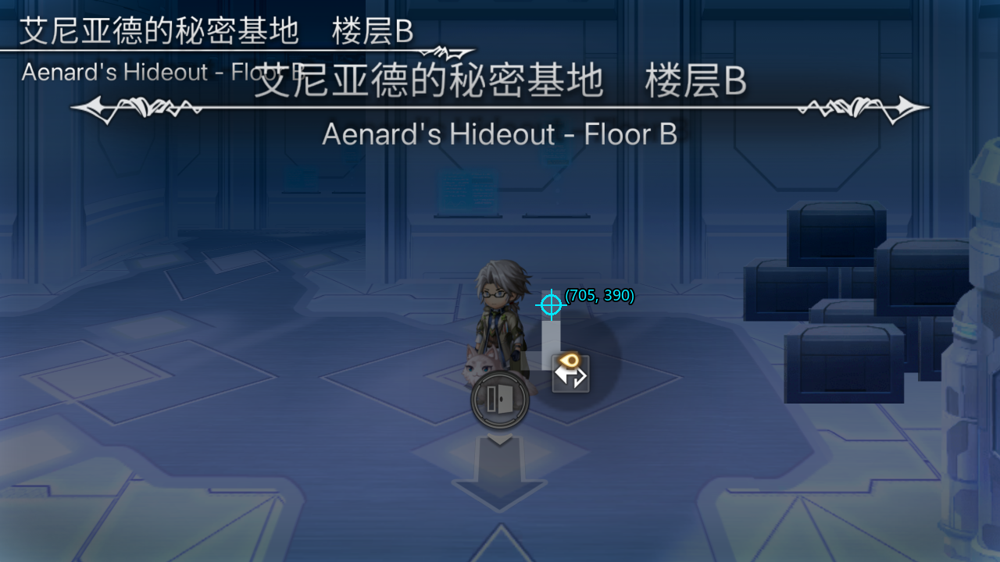

### 背叛之地伊丝卡莉欧忒

上方入口的平台；中间为断续台阶，未预设连通道路

道路：运行时自动提取。

最终记录：[result.json](D:/MAAEden/debug/minimap/survey/iskariot/run1/result.json)；尝试次数：1。

结果：小地图定位候选 0：小地图几何约束不符：inliers=6/19 scale=1.017 angle=0.58

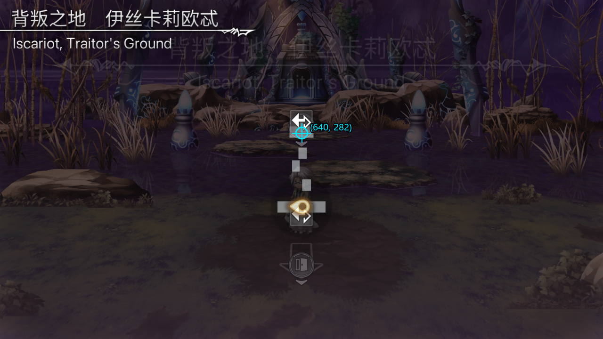

### 塔尔加纳山道

左下横路右半段

道路：人工按截图标定中心线。

最终记录：[result.json](D:/MAAEden/debug/minimap/survey/cat_48/run1/result.json)；尝试次数：1。

结果：小地图定位候选 0：小地图几何约束不符：inliers=5/15 scale=0.693 angle=178.55

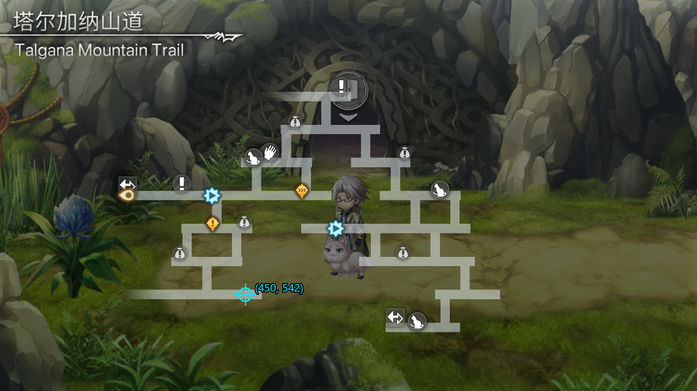

传送祭偶窟后点击房间下方出口进入山道；不计祭偶窟为导航样本

### 龙神池

最上方支路横台

道路：人工按截图标定中心线。

最终记录：[result.json](D:/MAAEden/debug/minimap/survey/cat_50/run1/result.json)；尝试次数：1。

结果：小地图定位候选 0：小地图几何约束不符：inliers=5/15 scale=0.498 angle=0.01

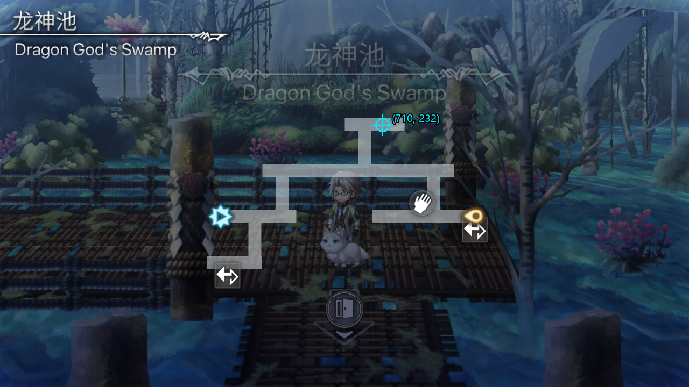

### 火之村拉托尔

最上方横路，猫图例左侧

道路：运行时自动提取。

最终记录：[result.json](D:/MAAEden/debug/minimap/survey/cat_01/run1/result.json)；尝试次数：1。

结果：独立展开图确认到达。

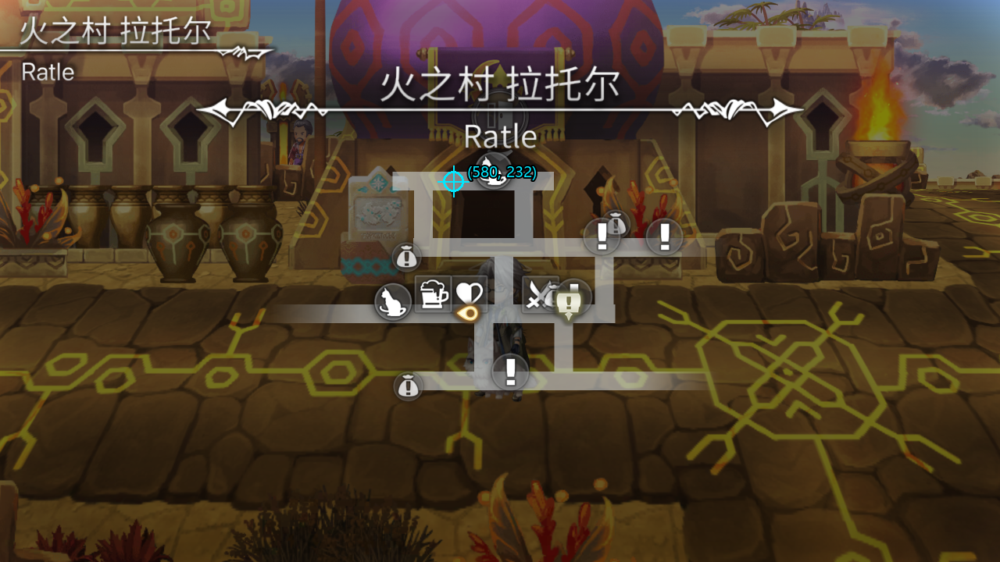

## 范围说明

努阿鲁平原、废道公路99和马克米纳尔图书馆未完成进入，未计入这 15 张。魔兽城城门外与祭偶窟小房间也未计为独立导航样本。

重复尝试不是独立样本；各图仅测试一个目标，没有测量全程坐标真值。全部原始帧、序列与日志位于 debug/minimap/survey。

这次未验证战斗恢复、跨图持续导航、不同分辨率和完整猫咪日记流程。实验入口未接入默认日常任务。
